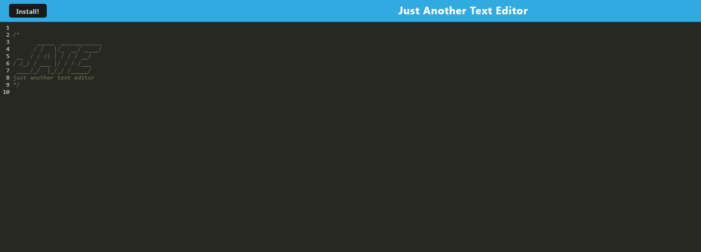

# Text Editor
  

  ## Description

  The application is a web based text editor that can be installed as a progressive web application. It saves data using IndexedDB and is deployed to Heroku.

## Table of Contents

- [Installation](#installation)
- [Usage](#usage)
- [License](#License)
- [Contributing](#contributing)
- [Tests](#tests)
- [Questions](#questions)
- [Screenshots](#screenshots)
- [Links](#links)

  ## Installation

  No installation is required to access the deployed application. To install the web application on your machine, click the install button in the top left.
  
  ## Usage

  The application can be used to write text, code, or notes as necessary. It saves the data once it is clicked out of to IndexedDB.

  ## License

  This project is licensed under the GNU GPLv3 license. Read more about the license here:
  https://choosealicense.com/licenses/gpl-3.0/
  

  ## Contributing

  Please fork and submit a pull request.

  ## Tests

  Test using a variety of inputs.

  ## Questions

  You can reach me at GitHub; my username is nathanh635 and my profile is here: https://github.com/nathanh635. 
  You can also email me at nathanh635@gmail.com. 
  
  ## Screenshots

  Below is a screenshot of the tested application.

  
## Links

  Repository: https://github.com/nathanh635/Text-Editor
  
  Heroku Deployment: https://radiant-temple-37153.herokuapp.com/

